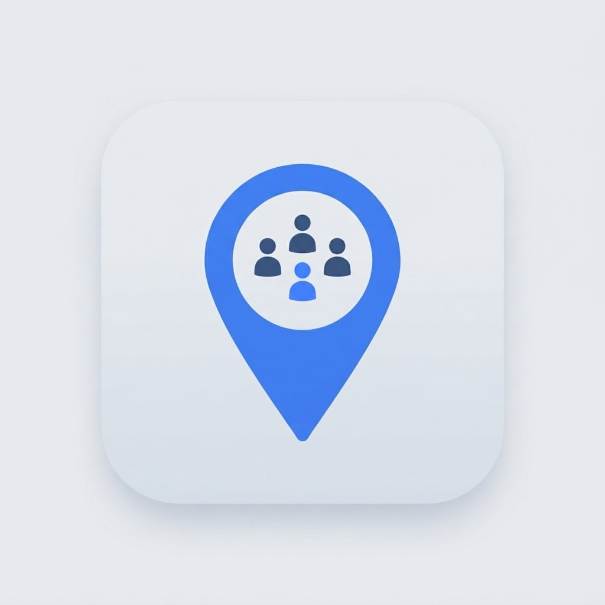

# 🎪 MyCrew — Real-Time Group Travel & Event Companion

<p align="center">
  
</p>

<p align="center">
  <b>Never lose your friends in the crowd. Privacy-first, real-time crew coordination for festivals, trips, and group adventures.</b>
</p>

<p align="center">
  
  
  
  
  
</p>

---

## 🌟 Overview

**MyCrew** is a mobile application built with React Native and Expo designed to solve the chaos of group outings—music festivals, road trips, hiking trails, theme parks, and crowded conventions. 

Unlike intrusive 24/7 family locators, MyCrew is **trip-bound and privacy-first**: location sharing only runs during an active trip, automatically expires when the event concludes, and gives every user one-tap control to pause location broadcasting at any time.

---

## ✨ Key Features

### 🗺️ Live Group Map & Smooth Tile Engine
- **Double-Buffered Smooth Panning**: Zero black screen flashes when panning or zooming. Tile transitions decode seamlessly in the background with oversized geographic buffers and Web Mercator projection locking.
- **Mapbox Vector & Satellite Styles**: Switch between *Streets*, *Outdoors*, *Satellite*, and *Dark Mode* themes on the fly.
- **Dynamic Group Clustering**: Nearby crew members automatically cluster into proximity pills (e.g., `Group (3)`), while your own marker (`[ YOU ]`) remains distinct.
- **Interactive Controls**: Touch-friendly zoom in/out, fit-to-group, toggle meeting points, and one-tap recenter to your live GPS coordinates.

### 📍 Manual Pin Pointer & Deletable Meeting Points
- **Interactive Pin Drop Mode**: Tap **"Set Meeting Point"** on the map to activate a center pointer pin (`📍 Drag map to position pin`). Pan the map to any location on earth and tap **"Set Meeting Point Here"** to place a rendezvous spot.
- **Custom Details & Geofencing**: Assign a custom name, landmark description, and notification radius (100m – 1000m).
- **Inline Meeting Point Deletion**: Meeting points can be removed directly from the map bottom sheet or the meeting points screen with inline confirmation and automatic Supabase synchronization.

### 👤 Profile Customization & Direct Emergency Calling
- **Device Photo Upload**: Select and crop your avatar directly from your device photo gallery (`expo-image-picker`) with automatic upload to Supabase Storage (`avatars` bucket).
- **Emergency Contact Numbers**: Users can add their contact number directly in their profile.
- **One-Tap Emergency Calling**: In the Emergency screen and member details, tap **"Call Member"** or **"Call Organizer"** to initiate a direct phone call (`tel:...`) with fallback to emergency services (112).

### 👥 Crew Directory & Live Status Tracking
- **Smart Role Badges**: Instant differentiation between `[ YOU ]` (current user), `[ HOST ]` (trip organizer), and `[ CREW ]` (members).
- **Location Freshness Engine**: Real-time heartbeat indicators:
  - 🟢 **Live**: Updated within the last 30 seconds.
  - 🟡 **Delayed**: Last signal between 30s – 2m ago (poor cell coverage / battery saving).
  - 🔴 **Offline**: Inactive for > 2 minutes or location sharing paused.
- **Distance Ordering**: Members are automatically sorted with you at the top, followed by the trip organizer, and everyone else by physical distance.

### 🧭 Peer-to-Peer Navigation & Radar
- **Walking Directions**: One-tap compass and distance guide leading directly to any crew member.
- **Relative Direction**: Real-time relative bearing indicators (`Straight ahead`, `Slight left`, etc.) based on device heading.
- **Group Radar**: Radial view displaying all crew members relative to your current orientation.

### 🛡️ Safety & Emergency Toolkit
- **Safety Check-in**: One-tap status updates ("Confirmed Safe") so the crew knows you are okay.
- **"I'm Lost" Mode**: Instantly alert the group with your last-known coordinates, battery level, and an emergency ping.
- **Emergency Screen**: Quick access to host contacts, nearest active crew members, and emergency response tools.

### 🔒 Privacy & Access Control
- **Event-Bound Sharing**: Location tracking only activates during active trips and stops immediately when a trip ends or is left.
- **Ghost Mode / Toggle Sharing**: Pause your live location from your Profile at any moment without leaving the trip.
- **Fast Join via QR & Trip Codes**: Join trips in seconds using 6-character alphanumeric codes or built-in camera QR code scanning (100% real Supabase data—no dummy mock trips).

---

## 🛠️ Tech Stack

| Category | Technology |
|---|---|
| **Framework** | [React Native 0.86](https://reactnative.dev/) / [Expo SDK 57](https://expo.dev/) |
| **Routing** | [Expo Router v57](https://docs.expo.dev/router/introduction/) (File-based navigation) |
| **Backend & Database** | [Supabase](https://supabase.com/) (PostgreSQL, Row-Level Security, Auth) |
| **File Storage** | Supabase Storage (`avatars` public bucket) |
| **Realtime Sync** | Supabase Realtime Channels (PostgreSQL replication events) |
| **Mapping Engine** | [Mapbox Static Images API](https://docs.mapbox.com/api/maps/static-images/) + Double-Buffered SVG Overlays |
| **State Management** | [Zustand v5](https://github.com/pmndrs/zustand) |
| **Location & Sensors** | `expo-location` (High-accuracy GPS, foreground tracking) |
| **Camera & QR** | `expo-camera` (QR code scanning) |
| **Image Picking** | `expo-image-picker` (Device photo selection & 1:1 cropping) |
| **Authentication** | Supabase Auth (Google OAuth via `expo-web-browser` + Email/Password) |
| **Build & CI/CD** | [EAS Build](https://docs.expo.dev/build/introduction/) (Standalone Android APK) |

---

## 📂 Project Structure

```
MyCrew/
├── app/                          # Expo Router file-based screens
│   ├── (auth)/                   # Authentication routes (login, sign-up, join)
│   │   ├── callback.js           # Deep-link auth callback redirect
│   │   ├── index.js              # Welcome & sign-in screen
│   │   └── join.js               # Join trip by code or QR camera scan
│   ├── (onboarding)/             # Initial user permission & setup flow
│   ├── (tabs)/                   # Main application tab navigator
│   │   ├── _layout.js            # Bottom navigation bar & location engine hook
│   │   ├── home.js               # Dashboard, live map card, quick actions
│   │   ├── map.js                # Full-screen interactive map & pin drop mode
│   │   ├── people.js             # Crew member list with status & distance
│   │   ├── trip.js               # Trip details, join code, expiration timer
│   │   └── profile.js            # User profile, photo upload, contact number, privacy
│   ├── auth/
│   │   └── callback.js           # Native Google OAuth callback handler
│   ├── features/                 # Dedicated feature screens
│   │   ├── check-in.js           # Safety check-in modal
│   │   ├── emergency.js          # SOS broadcast & one-tap calling
│   │   ├── find-nearest.js       # Nearest member finder
│   │   ├── find-people.js        # Member search & quick filter
│   │   ├── group-radar.js        # Compass-based radial radar
│   │   ├── group-status.js       # Group breakdown & status overview
│   │   ├── im-lost.js            # "I'm Lost" alert broadcast
│   │   ├── meeting-point.js      # List & create rendezvous points with delete
│   │   ├── navigation.js         # Turn-by-turn member walking guide
│   │   ├── person.js             # Detailed member status & call actions
│   │   ├── privacy.js            # Location sharing preferences
│   │   └── smart-tracking.js     # Battery-aware tracking settings
│   ├── _layout.js                # Root layout & auth state listener
│   └── index.js                  # Entry router & session check
├── assets/                       # App icons, splash screens, adaptive icons
├── src/
│   ├── components/               # Modular UI components
│   │   ├── AppHeader.js          # Standard top navigation header
│   │   ├── BottomSheet.js        # Slide-up modal sheet
│   │   ├── MapControls.js        # Floating map action buttons (+, -, recenter)
│   │   ├── MapView.js            # Double-buffered Mapbox engine with Mercator math
│   │   ├── MemberAvatar.js       # Avatar with status dot indicator
│   │   ├── MemberCard.js         # Crew list card with role badges (YOU/HOST/CREW)
│   │   ├── MemberMarker.js       # Map pin for crew members
│   │   ├── PrimaryButton.js      # Branded high-emphasis action button
│   │   ├── SecondaryButton.js    # Outlined & subtle buttons
│   │   └── StatusBadge.js        # Live / Delayed / Offline status pill
│   ├── constants/                # Design system & app configuration
│   │   ├── config.js             # Centralized config with crash-proof fallbacks
│   │   └── theme.js              # Colors, typography, shadows, border radii
│   ├── hooks/                    # Custom React hooks
│   │   ├── useHapticFeedback.js  # Haptic vibrations for taps and alerts
│   │   └── useLocationEngine.js  # GPS tracking, heartbeat timer & Realtime sync
│   ├── services/                 # External service integrations
│   │   ├── authService.js        # Supabase authentication & Google OAuth
│   │   ├── locationService.js    # GPS coordinates, distance, bearing & clusters
│   │   ├── mapService.js         # Mapbox static tile URLs & Web Mercator math
│   │   ├── meetingPointService.js# Supabase meeting points CRUD
│   │   ├── memberService.js      # Crew member utilities & safety flags
│   │   ├── supabase.js           # Safe Supabase client singleton with fallbacks
│   │   └── tripService.js        # Trip CRUD, membership & Realtime channels
│   ├── store/                    # Zustand global state stores
│   │   ├── useCrewStore.js       # Crew members, statuses, clusters & local state
│   │   ├── useLocationStore.js   # User GPS coordinate, accuracy & permissions
│   │   ├── useMeetingPointStore.js# Active trip meeting points
│   │   ├── useTripStore.js       # Current active trip & trip history
│   │   └── useUserStore.js       # Authenticated user profile, photo & phone
│   └── utils/                    # Utility functions
│       ├── distance.js           # Haversine distance, bearing & group centroid
│       └── freshness.js          # Timestamp-to-freshness state evaluator
├── app.json                      # Expo application manifest & permissions
├── eas.json                      # EAS Build profiles (preview APK & production)
└── package.json                  # NPM dependencies & scripts
```

---

## 🚀 Getting Started

### Prerequisites

Ensure you have the following installed on your machine:
- **Node.js**: v18.0.0 or higher
- **NPM** or **Bun**
- **Git**
- *(Optional for native debugging)*: **Android Studio** with Android Emulator / **Xcode** (macOS)

### 1. Clone the Repository

```bash
git clone https://github.com/Brijesh1919/MyCrew.git
cd MyCrew
```

### 2. Install Dependencies

```bash
npm install
```

### 3. Environment Variables Configuration

Create a `.env` file in the root directory (the app also includes built-in fallbacks to prevent crashes):

```ini
# Supabase Configuration
EXPO_PUBLIC_SUPABASE_URL=https://your-project.supabase.co
EXPO_PUBLIC_SUPABASE_ANON_KEY=your-supabase-anon-key

# Mapbox Configuration
EXPO_PUBLIC_MAPBOX_ACCESS_TOKEN=pk.your-mapbox-public-access-token
```

> **Note:** The `EXPO_PUBLIC_` prefix allows these variables to be bundled automatically into client-side code by Expo.

---

## 💻 Development Commands

| Command | Description |
|---|---|
| `npx expo start` | Start the Expo Metro development server |
| `npx expo start --android` | Open the app directly on a connected Android device or emulator |
| `npx expo start --ios` | Open the app on iOS Simulator |
| `npx expo start --web` | Run the app in a web browser |
| `npx expo-doctor` | Run health checks on dependencies and configurations |
| `npx expo lint` | Lint codebase with ESLint |
| `npx expo export --platform android` | Test production Metro bundling locally |

---

## 📦 Building a Standalone Android APK

MyCrew is configured with **EAS Build** to produce standalone Android `.apk` files that install and run independently without requiring Expo Go or a running development server.

### 1. Install EAS CLI

```bash
npm install -g eas-cli
# or run directly with npx
npx eas-cli@latest --version
```

### 2. Build Internal / Preview APK

Run the preview build profile:

```bash
npx eas-cli@latest build --platform android --profile preview
```

### 3. Install on Android Device or Emulator

Once EAS finishes building:
1. Scan the terminal QR code or open the Expo build URL on your Android phone to download the `.apk`.
2. Or let EAS automatically install to your running emulator by answering `yes` when prompted:
   ```
   √ Install and run the Android build on an emulator? ... yes
   ```

---

## 🗄️ Backend & Supabase Architecture

MyCrew utilizes Supabase for authentication, PostgreSQL data storage, Supabase Storage for user avatars, and Realtime WebSocket replication.

### Database Tables & Storage

1. **`profiles`**:
   - `id`: UUID (Primary Key, references `auth.users`)
   - `full_name`: Display name
   - `avatar_url`: Public URL of profile image
   - `phone`: Contact phone number for emergency calling

2. **`trips`**:
   - `id`: UUID (Primary Key)
   - `trip_code`: 6-character unique join code (e.g., `TRIP26`)
   - `name`: Name of the trip/event
   - `emoji`: Event icon representation
   - `owner_id`: Reference to `auth.users`
   - `starts_at`, `ends_at`: Event lifespan timestamps
   - `latitude`, `longitude`: Optional event centroid

3. **`trip_members`**:
   - `trip_id`: Reference to `trips.id`
   - `user_id`: Reference to `auth.users`
   - `user_name`: Member display name
   - `avatar_url`: Member avatar
   - `phone`: Contact phone number
   - `role`: `'organizer'` or `'participant'`
   - `latitude`, `longitude`: Live device GPS coordinate
   - `location_accuracy`, `location_heading`, `location_speed`: Sensor telemetry
   - `location_updated_at`: ISO timestamp for freshness evaluation
   - `left_at`: Timestamp if member has left the trip

4. **`meeting_points`**:
   - `id`: UUID (Primary Key)
   - `trip_id`: Reference to `trips.id`
   - `name`: Custom rendezvous label
   - `description`: Landmark description
   - `created_by`: Reference to `auth.users`
   - `created_by_name`: Creator display name
   - `latitude`, `longitude`: Coordinate of the meeting point
   - `radius_meters`: Proximity radius (default 500m)
   - `created_at`: Creation timestamp

5. **Storage Bucket (`avatars`)**:
   - Public bucket storing profile pictures uploaded directly from users' devices.

### Realtime Location Channel

When a user joins an active trip, [`useLocationEngine`](src/hooks/useLocationEngine.js) subscribes to PostgreSQL changes on `trip_members` filtered by `trip_id`:

```javascript
supabase
  .channel(`trip-locations:${tripId}`)
  .on(
    'postgres_changes',
    {
      event: '*',
      schema: 'public',
      table: 'trip_members',
      filter: `trip_id=eq.${tripId}`,
    },
    (payload) => {
      // Updates member positions and freshness states in Zustand
    }
  )
  .subscribe();
```

---

## 📱 Permissions Configuration

The application configures the following native permissions in [`app.json`](app.json):

- **Location** (`ACCESS_FINE_LOCATION`, `ACCESS_COARSE_LOCATION`): Used while part of an active crew to enable friends to find you.
- **Camera** (`CAMERA`): Used to scan crew QR codes for instant trip onboarding.
- **Photo Library**: Used when uploading a custom avatar image from the device gallery.

---

## 📄 License

This project is private and proprietary. All rights reserved.

---

<p align="center">
  Built with ❤️ for crews, travelers, and festival-goers everywhere.
</p>
